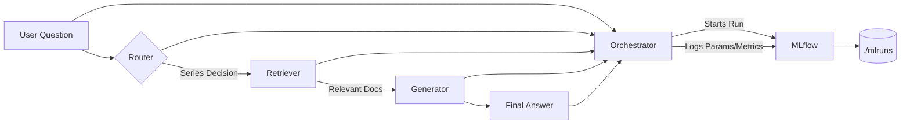

## 🏗️ Architecture & Design

This project implements a **Retrieval-Augmented Generation (RAG) agent** for technical support of ECU (Embedded Control Unit) product lines. The system intelligently routes user questions to the correct documentation sources, retrieves relevant technical snippets, and generates accurate answers using a local LLM (`llama3.1`). All interactions are automatically logged to **MLflow** for observability and iteration.

### 🔧 Core Components

| Component | Responsibility | Technology |
|---------|----------------|-----------|
| **Router** | Analyzes user questions and determines which ECU series (`700`, `800B`, `800P`) to query. Handles comparisons, general queries, and unknown cases. | Rule-based keyword matching with regex |
| **Retriever** | Fetches relevant technical documentation chunks from ChromaDB vector stores based on the routed series. Supports single-series, multi-series, and "all-series" retrieval. | `ChromaDB` + `HuggingFace/bge-small-en-v1.5 Embeddings` (for embedding only; no OpenAI API used in generation) |
| **Generator** | Synthesizes a natural language answer using retrieved context and the user question. Runs entirely **locally**. | `Ollama` + `llama3.1` (via LangChain) |
| **Orchestrator** | Coordinates the full pipeline: route → retrieve → generate. Wraps execution in an MLflow run for tracking. | Custom Python function (`run_ecu_agent_with_mlflow`) |
| **MLflow Tracker** | Logs every user interaction as an MLflow Run, capturing input, routing decision, retrieval stats, and output for debugging and analysis. | Local MLflow (`./mlruns`) |

### 🔄 Data Flow



### 🚀 FastAPI REST API

The RAG agent is exposed as a production-ready REST API using **FastAPI**, enabling easy integration with web applications, chatbots, or internal tools.

#### ▶️ Run api
```bash
cd /path/to/your/project
uvicorn api:app --host 0.0.0.0 --port 8000 --reload
```
#### ▶️ Test api
```PowerShell
$response = Invoke-RestMethod -Uri "http://127.0.0.1:8000/ask" `
    -Method Post `
    -Headers @{
        "accept" = "application/json"
        "Content-Type" = "application/json"
    } `
    -Body (@{
        question = "How much RAM does the ECU-850 have?"
    } | ConvertTo-Json)

$response
```

