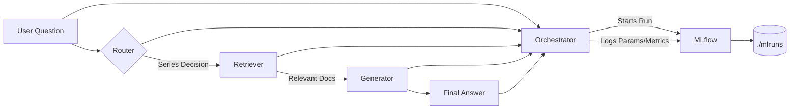

## 🏗️ Architecture & Design

This project implements a **Retrieval-Augmented Generation (RAG) agent** for technical support of ECU (Embedded Control Unit) product lines. The system intelligently routes user questions to the correct documentation sources, retrieves relevant technical snippets, and generates accurate answers using a local LLM (`llama3.1`). All interactions are automatically logged to **MLflow** for observability and iteration.

Ollama + llama3.1:8b (https://github.com/ollama/ollama/releases)

```bash
curl -L -o ollama_installer.exe https://ollama.com/download/OllamaSetup.exe
ollama --version
ollama pull llama3.1:8b
ollama list
curl http://localhost:11434/api/tags
```

### 🔧 Core Components

| Component | Responsibility | Technology |
|---------|----------------|-----------|
| **Router** | Analyzes user questions and determines which ECU series (`700`, `800B`, `800P`) to query. Handles comparisons, general queries, and unknown cases. | Rule-based keyword matching with regex |
| **Retriever** | Fetches relevant technical documentation chunks from ChromaDB vector stores based on the routed series. Supports single-series, multi-series, and "all-series" retrieval. | `ChromaDB` + `HuggingFace/bge-small-en-v1.5 Embeddings` (for embedding only; no OpenAI API used in generation) |
| **Generator** | Synthesizes a natural language answer using retrieved context and the user question. Runs entirely **locally**. | `Ollama` + `llama3.1` (via LangChain) |
| **Orchestrator** | Coordinates the full pipeline: route → retrieve → generate. Wraps execution in an MLflow run for tracking. | Custom Python function (`run_ecu_agent_with_mlflow`) |
| **MLflow Tracker** | Logs every user interaction as an MLflow Run, capturing input, routing decision, retrieval stats, and output for debugging and analysis. | Local MLflow (`./mlruns`) |

### 🔄 Data Flow



### 🚀 FastAPI REST API

The RAG agent is exposed as a production-ready REST API using **FastAPI**, enabling easy integration with web applications, chatbots, or internal tools.

#### ▶️ Run api
```bash
cd ecu_agent/src
uvicorn api:app --host 0.0.0.0 --port 8000 --reload
```
#### ▶️ Test api
```PowerShell
$response = Invoke-RestMethod -Uri "http://127.0.0.1:8000/ask" `
    -Method Post `
    -Headers @{
        "accept" = "application/json"
        "Content-Type" = "application/json"
    } `
    -Body (@{
        question = "How much RAM does the ECU-850 have?"
    } | ConvertTo-Json)

$response
```

#### MLflow model for learning and test
Project Structure
```bash
ecu_agent/
│
├── data/                              # 数据文件
│   ├── ECU-700_Series_Manual.md      # ECU-700系列手册
│   ├── ECU-800_Series_Base.md        # ECU-800基础版手册
│   └── ECU-800_Series_Plus.md        # ECU-800增强版手册
│
├── scripts/                           # 脚本文件
│   └── build_model.py                # 构建MLflow模型
│
├── src/                              # 源代码
│   ├── _ _init_ _.py                   # Python包初始化
│   ├── model.py                      # MLflow模型实现
│   ├── agent.py                      # 智能体逻辑
│   ├── rag.py                        # RAG核心功能
│   ├── config.py                     # 配置管理
│   ├── utils.py                      # chunking模块
│   └── tools.py                      # 工具模块
│
├── chroma_db/                        # 向量数据库存储
│   ├── ecu_700/                      # ECU-700向量数据
│   │   ├── chroma.sqlite3
│   │   ├── index/
│   │   └── ...
│   ├── ecu_800B/                     # ECU-800基础版向量数据
│   └── ecu_800P/                     # ECU-800增强版向量数据
│
├── models/                           # 模型文件
│   ├── bge-small-en-v1.5/            # 嵌入模型
│   │   ├── 1_Pooling/
│   │   ├── config.json
│   │   ├── pytorch_model.bin
│   │   └── ...
│   │
│   └── test_model/                   # MLflow打包的模型
│       ├── MLmodel                   # 模型配置文件
│       ├── conda.yaml               # Conda环境配置
│       ├── python_env.yaml          # Python环境配置
│       ├── requirements.txt         # 依赖列表
│       ├── artifacts/               # 模型工件
│       │    └── chroma_root -> ../../chroma_db  # 符号链接或引用
│       └──code/src
│
├── pyproject.toml                  # Python依赖
├── conda.yaml                      # Conda环境配置
├── README.md                       # 项目说明文档
├── runMLflowModelServe.bat         # 启动mlflow test_model脚本
├── dockfile                        # dockerfile
├── .gitignore                      # Git忽略文件
├── .pylintrc                       # Git忽略文件
└── .env.example                    # 环境变量示例
```

### Docker in China
    "registry-mirrors": [
        "https://docker.xuanyuan.me"
    ]

### Future improvement
1.Try some other LLM instead of my loacl llama3.1:8b

2.Try some other chunking model

3.Learn more about the MLflow and implement on a real project

4.Regarding docker, test more.